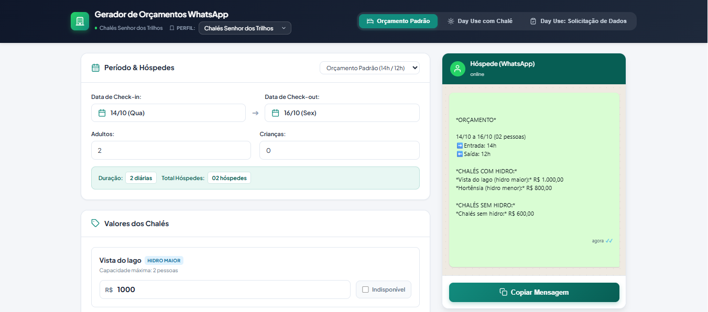
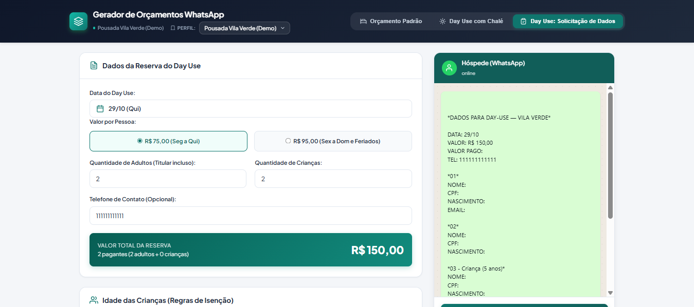

# StayMessage Engine

> High-performance, client-side quotation engine and WhatsApp message synthesis platform for hospitality operations.

**Live Deployment:** [https://orcamentosdt.netlify.app/](https://orcamentosdt.netlify.app/)

`Vanilla JavaScript (ES6+)` | `CSS3 Custom Properties` | `Native ES Modules` | `Zero External Dependencies` | `Zero Build Step`

---

## Interface Preview

The interface operates as a dual-pane workspace: quotation controls and business policy toggles on the left, coupled with a real-time WhatsApp rendering canvas on the right.


*Figure 1: Primary quotation workspace displaying standard stay controls, inventory cards with subtle monetary placeholders, and live WhatsApp conversation synthesis.*


*Figure 2: Runtime theme injection switching to secondary establishment tokens, coupled with dynamic Day Use tier calculations and guest exemption cards.*

---

## Architecture and Design Principles

StayMessage Engine is built as an agnostic, white-label frontend architecture. It enforces strict separation of concerns between core application mechanics and client-specific business rules.

```
┌────────────────────────────────────────────────────────────────────────┐
│                          STAYMESSAGE RUNTIME                           │
├───────────────────────────────────┬────────────────────────────────────┤
│           CORE ENGINE             │          CLIENT PROFILES           │
│           (js/engine/)            │           (js/profiles/)           │
├───────────────────────────────────┼────────────────────────────────────┤
│ • Application State Coordination  │ • Establishment Identity & Meta    │
│ • DOM Lifecycle & Transitions     │ • Unit Inventory & Tag Semantics   │
│ • Dynamic Calendar & Date Range   │ • Tiered Pricing & Suggestions     │
│ • Tag-Based Policy Enforcement    │ • Day Use Age Exemption Models     │
│ • WhatsApp Message Synthesis      │ • Brand Tokens (Hex & SVG Icons)   │
└───────────────────────────────────┴────────────────────────────────────┘
```

### Core Tenets

1. **Agnostic Engine (`js/engine/`)**: The calculation and rendering engine contains zero hardcoded property names, cottage identifiers, or client-specific pricing assumptions.
2. **Runtime Theme Injection**: Establishment profiles define color tokens (`colorPrimary`, `colorPrimaryLight`, etc.) and brand marks. Switching profiles injects CSS custom properties directly into `:root` without triggering a full page reload or CSS re-parsing.
3. **Tag-Based Business Logic**: Operational restrictions (e.g., child restrictions on units equipped with hydro spas) are evaluated dynamically against unit tags (`tags: ['hydro']`) rather than brittle identity checks.
4. **Zero State Bleed**: Profile switching clears all client-specific inputs, active exception modals, and manual overrides in memory, guaranteeing an absolute clean slate between customer inquiries.
5. **Zero Dependencies**: Developed natively against modern web standards. No Node.js runtime, build tools, bundlers, or third-party frameworks required.

---

## Directory Structure

```text
.
├── index.html                           # Application shell, navigation tabs, and preview layout
├── css/
│   └── style.css                        # Design system tokens, component styles, and responsiveness
├── js/
│   ├── engine/                          # Agnostic Engine Modules
│   │   ├── app.js                       # Application entry point, state lifecycle, and DOM handlers
│   │   ├── calendar.js                  # Dual-month DateRangePicker component
│   │   ├── message-builder.js           # Pure WhatsApp quotation synthesis module
│   │   └── utils.js                     # Arithmetic formatters, ISO dates, and clipboard APIs
│   └── profiles/                        # Establishment Profiles
│       ├── schema.template.js           # Profile contract specification with full JSDoc typing
│       ├── registry.js                  # Profile lookup index and active establishment resolver
│       └── clients/                     # Active and demonstration property definitions
│           ├── senhor-dos-trilhos.profile.js  # Production profile
│           └── vila-verde.profile.js          # Demonstration profile (Demo)
├── docs/                                # Documentation assets and interface screenshots
└── old/                                 # Historical specifications and multi-phase roadmaps
    └── future-roadmap.md                # Prospective feature roadmap (Phases 3 to 6)
```

---

## Local Execution

Because StayMessage Engine utilizes native browser ES Modules (`import`/`export`), the application must be loaded over an HTTP/HTTPS origin rather than the local file system (`file://`).

Start a static HTTP server from the project root:

```bash
# Python 3
python -m http.server 3000

# Node.js
npx serve -l 3000

# PHP
php -S localhost:3000
```

Navigate to `http://localhost:3000` in any modern Chromium, Gecko, or WebKit browser.

---

## Integration Guide: Adding a New Establishment

Onboarding a new hotel, pousada, or resort requires zero modifications to the core engine.

### 1. Create the Client Profile

Duplicate `js/profiles/schema.template.js` and save it to `js/profiles/clients/<establishment-slug>.profile.js`.

Configure the identity, inventory, and policy definitions:

```javascript
export const HOTEL_EXEMPLO_PROFILE = {
  id: 'hotel_exemplo',
  meta: {
    id: 'hotel_exemplo',
    name: 'Hotel Exemplo Resort',
    propertyType: 'resort',
    currency: 'BRL',
    currencySymbol: 'R$',
    theme: {
      colorPrimary: '#1e3a8a',
      colorPrimaryDark: '#172554',
      colorPrimaryLight: '#3b82f6',
      colorPrimarySubtle: '#eff6ff',
      brandIconSvg: `<svg viewBox="0 0 24 24" width="24" height="24" stroke="currentColor" stroke-width="2" fill="none">
        <path d="M3 21h18M5 21V5a2 2 0 0 1 2-2h10a2 2 0 0 1 2 2v16" />
      </svg>`
    }
  },
  accommodations: [
    {
      id: 'suite_master',
      name: 'Suíte Master com Hidro',
      label: 'Suíte Master',
      sublabel: 'Capacidade máxima: 2 pessoas',
      category: 'SUÍTES',
      tags: ['hydro'],
      maxCapacity: 2,
      placeholder: '0,00',
      badge: { text: 'Hidro', cssClass: 'cat-hydro' }
    },
    {
      id: 'chale_familia',
      name: 'Chalé Família Standard',
      label: 'Chalé Família',
      sublabel: 'Capacidade máxima: 4 pessoas',
      category: 'CHALÉS',
      tags: [],
      maxCapacity: 4,
      placeholder: '0,00',
      badge: { text: 'Padrão', cssClass: 'cat-no-hydro' }
    }
  ],
  pricing: {
    datalistSuggestions: [350, 450, 600, 850, 1200]
  },
  dayUse: {
    priceOptions: [
      { value: 65, label: 'R$ 65,00 (Seg a Qui)' },
      { value: 85, label: 'R$ 85,00 (Sex a Dom e Feriados)' }
    ],
    defaultPricePerPerson: 65,
    exemptions: {
      childrenMaxFreeAge: 7,
      maxFreeChildrenPerBooking: 2
    }
  },
  policies: {
    childRestrictions: {
      enabled: true,
      restrictedTags: ['hydro'],
      blockedMessage: 'Não permite crianças'
    }
  },
  whatsappTemplates: {
    standardBudget: {
      header: '*ORÇAMENTO - HOTEL EXEMPLO*',
      rules: [
        'Horário de entrada: 14:00h | Horário de saída: 12:00h',
        'Incluso café da manhã colonial'
      ],
      paymentTerms: 'Forma de pagamento: 50% para reserva e restante no check-in.'
    }
  }
};
```

### 2. Register in Profile Registry

Register the exported profile object in `js/profiles/registry.js`:

```javascript
import { SENHOR_DOS_TRILHOS_PROFILE } from './clients/senhor-dos-trilhos.profile.js';
import { VILA_VERDE_PROFILE } from './clients/vila-verde.profile.js';
import { HOTEL_EXEMPLO_PROFILE } from './clients/hotel-exemplo.profile.js';

export const PROFILE_REGISTRY = {
  senhor_dos_trilhos: SENHOR_DOS_TRILHOS_PROFILE,
  vila_verde: VILA_VERDE_PROFILE,
  hotel_exemplo: HOTEL_EXEMPLO_PROFILE
};
```

### 3. Expose in Header Dropdown

Append the `<option>` entry within `#profile-switcher-select` inside `index.html`:

```html
<select id="profile-switcher-select" class="profile-switcher-select" aria-label="Selecione o Estabelecimento">
  <option value="senhor_dos_trilhos">Chalés Senhor dos Trilhos</option>
  <option value="vila_verde">Pousada Vila Verde (Demo)</option>
  <option value="hotel_exemplo">Hotel Exemplo Resort</option>
</select>
```

Upon selection, the engine automatically reconciles state, recalculates rules, and updates theme tokens.

---

## Technical Specifications

| Layer | Implementation |
|---|---|
| Language Standard | ECMAScript 2022+ (ES Modules) |
| Styling Paradigm | Vanilla CSS3 (Custom Properties, Flexbox, CSS Grid) |
| Date Management | Native JavaScript `Date` API (ISO 8601 formatting) |
| Clipboard Delivery | Asynchronous Clipboard API (`navigator.clipboard.writeText`) with `execCommand` fallback |
| Client Storage | In-memory session state (Strict reload reset) |
| Browser Compatibility | Chrome >= 90, Firefox >= 90, Safari >= 15, Edge >= 90 |

---

## License and Attribution

Copyright © 2026 StayMessage Engine. Internal enterprise tooling. All rights reserved.
